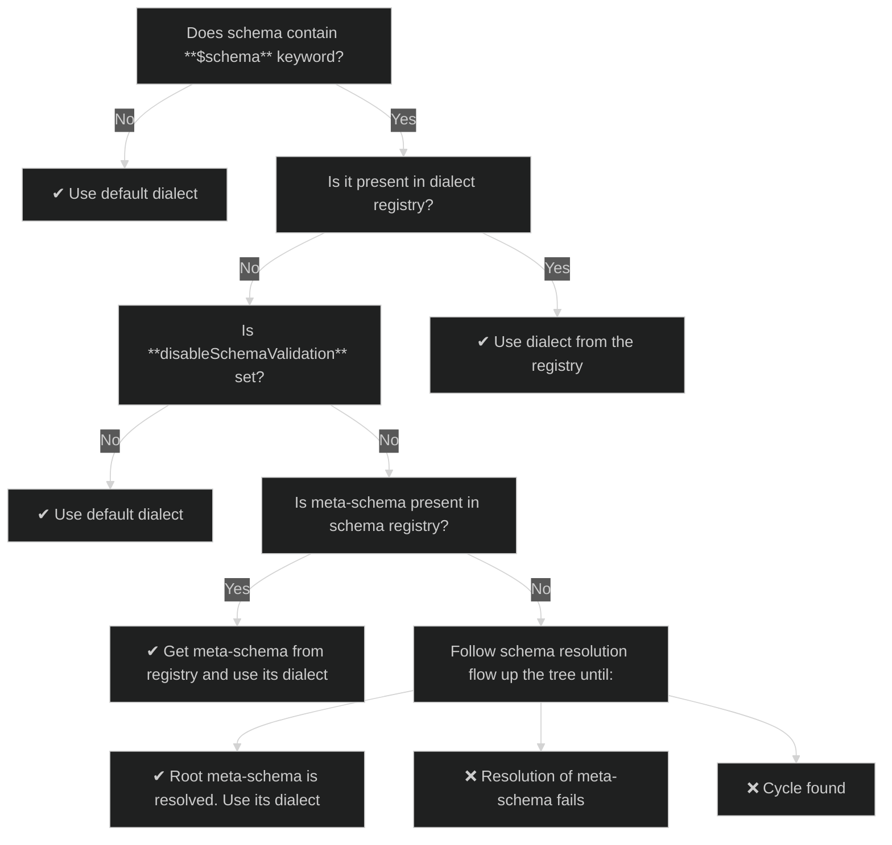

# Dialect details

## Dialect registry

Each validator object contains an internal dialect registry which is used to recognize dialect based on `$schema` keyword value.
By default, all official currently supported JSON Schema specification dialects are present in the registry.
The registry can be updated:
```java
new ValidatorFactory().withDialect(new CustomDialect);
```

> Calling `withDialect` method is basically an equivalent of:
> ```java
> dialectRegistry.put(dialect.getMetaSchema(), dialect);
> ```

> Returning `null` from `getMetaSchema()` is **NOT** recommended, and it will prevent it from being registered.
> {style=warning}

Please note that overriding existing dialects in the registry is also possible.
To do so, create a dialect implementation which returns the same value from `getMetaSchema()` as the one you want to override.

> Removing dialects from registry is not supported.

## Default dialect

If schema does not contain a `$schema` keyword, a default dialect will be used.
By default, the default dialect is `Draft 2020-12`. You can change it by calling:
```java
new ValidatorFactory().withDefaultDialect(new CustomDialect);
```

Moreover, if you set `disabledSchemaValidation` to `true`,
then the default dialect will be picked for any unknown (by dialect registry) `$schema` keyword values.

> JSON Schema specification does not clearly define what should be done if `$schema` keyword is missing,
> so relaying on that behavior is generally not recommended.
> Other implementations might even forbid such configurations.
> {style=warning}

## Dialect types

Depending on your needs, you might want to define only specific parts of a dialect.

<procedure title='Meta-schema only'>
This is the only official way to extend/create dialects, and it's implementation-agnostic.

**You will need:**
1. The actual meta-schema:
    - It can be provided either by `SchemaResolver` or registered directly in `Validator` instance.
    - It has to finally resolve to an actual concrete dialect (from dialect registry).
      It cannot be recursive, either directly or indirectly - it may reference (by `$schema`) another "meta-schema only" dialect,
      but eventually the chain of references must point to a dialect from the dialect registry.

**It allows you:**
1. Changing active vocabularies (by `$vocabulary` keyword). You can, for example, disable all validation keywords.
2. Defining custom validation for your schemas.

**You will not be able to:**
1. Define custom keywords, as the logic cannot be expressed directly in JSON.
2. Make the dialect independent of another one. As mentioned before: it eventually needs to point to a registered dialect.
3. Change the supported, required and default vocabularies.
</procedure>

<procedure title='Dialect without meta-schema'>
This is not really recommended approach as such a dialect can only be used as a default dialect.

**You will need:**
1. The actual implementation of `Dialect`.

**It allows you (only for schemas lacking `$schema` keyword):**
1. Defining custom keywords via `EvaluatorFactory`.
2. Defining custom validation for your schemas.
3. Changing active vocabularies (by `$vocabulary` keyword). You can, for example, disable all validation keywords.
4. Changing the supported, required and default vocabularies.

**You will not be able to:**
1. Define custom validation for your schemas.
2. Apply to schemas with resolvable `$schema` values.
</procedure>

<procedure title='Full dialect'>
The combination of two previous approaches.

**You will need:**
1. The actual meta-schema:
    - It can be provided either by `SchemaResolver` or registered directly in `Validator` instance.
    - It can be recursive.
2. The actual implementation of `Dialect`.

**It allows you:**
1. Defining custom keywords via `EvaluatorFactory`.
2. Changing the supported, required and default vocabularies.
</procedure>

## Dialect resolution process


